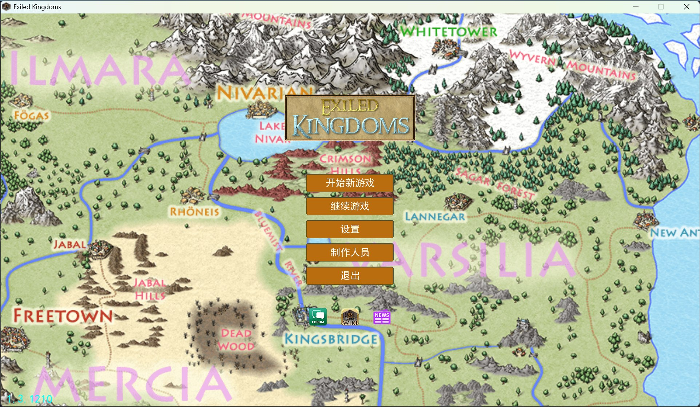
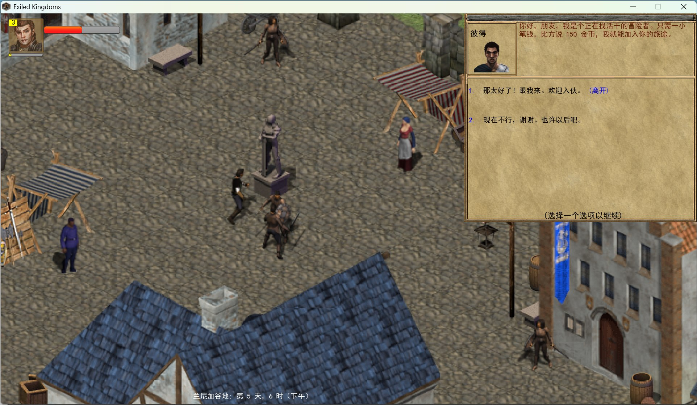
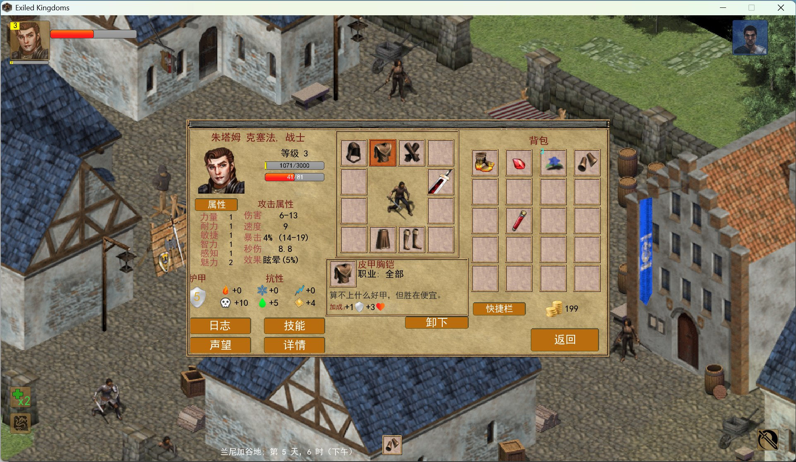

# Exiled Kingdoms 汉化补丁 / 放逐王国 中文汉化

[Exiled Kingdoms](https://store.steampowered.com/app/788270/Exiled_Kingdoms/)（放逐王国）Steam 版 v1.3.1210 的完整中文汉化补丁。

覆盖游戏全部文本：主线与支线对话、任务、物品、图鉴、技能、阵营介绍、随机人名、悬赏目标、时间格式，以及技能冷却等 UI 硬编码文案。

## 预览

<p align="center">
  
</p>

## 特性

- **翻译情况**：对话 7835 句、任务 754 条、物品 724 件、图鉴 419 条、技能 313 条
- **一键安装**：`apply_patch.bat`（Windows 自带 PowerShell）自动完成备份、补丁、数据部署与字体生成
- **零字体分发**：补丁不含字体数据，安装时用系统自带的 SimHei 字体现场生成
- **随时还原**：脚本内置卸载选项，自动还原英文原版

## 环境要求

- Steam 版 Exiled Kingdoms **v1.3.1210**（build 11985424）
- **中文 Windows**（简体数据文件为 GBK 编码 + 依赖系统自带 SimHei 字体）
- 无需额外运行时（安装脚本使用 Windows 自带 PowerShell）

## 安装

1. 完全退出游戏
2. 双击运行 `apply_patch.bat`（脚本会自动定位游戏目录，找不到时按提示输入路径）
3. 等待安装完成（字体生成约 8-10 分钟）
4. 从 Steam 启动游戏 → Options → Language → 选择 **Русский** → 界面即为中文
   （中文写在俄语资源槽位）

> 若 Steam 提示文件不一致，点取消即可；「验证文件完整性」会还原英文原版，重跑安装脚本即可恢复中文。

## 从源码构建

```
docs/     翻译源 JSON（trans_*.json，按游戏数据文件组织）+ 术语表/世界观/人物档案
tools/    构建脚本（数据打包、字体生成、字节码补丁、文本提取）
fontbm/   fontbm 字体渲染工具（MIT 开源）及依赖
patch/    一键安装脚本
```

构建流程详见 `tools/` 内各脚本的调用方式；字体由 `build_fonts.sh`（fontbm）按
`chars_all.txt` 字符集生成 18 档位图字体，`build_rules.py` 将翻译 JSON 写回游戏
数据格式（注意：任务变体与随机名文件需 GBK 编码写入）。

## 已知限制

- 游戏启动画面的 "Loading..." 为美术字贴图，保留英文
- 旧存档中已生成的随机 NPC 名字保持英文（新生成的为中文）

## 许可

- 翻译文本与脚本：MIT
- 不包含任何游戏原始文件，请支持正版
- fontbm：MIT（`fontbm/LICENSE`），随附依赖库许可见 `fontbm/THIRD_PARTY_NOTICES.txt`；
  SimHei 字形位图由安装者本机 Windows 授权字体生成，不在本仓库分发
